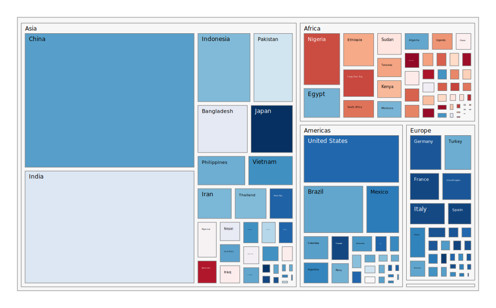
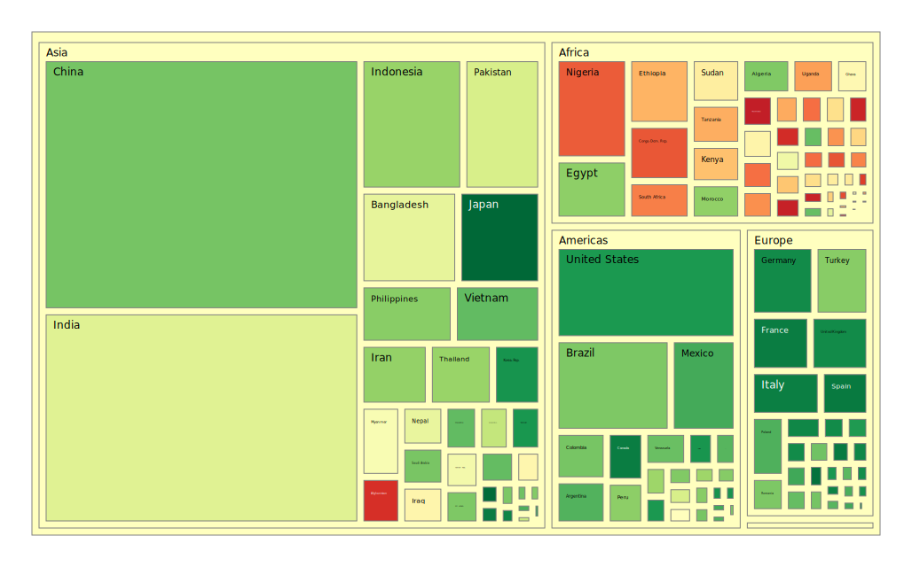
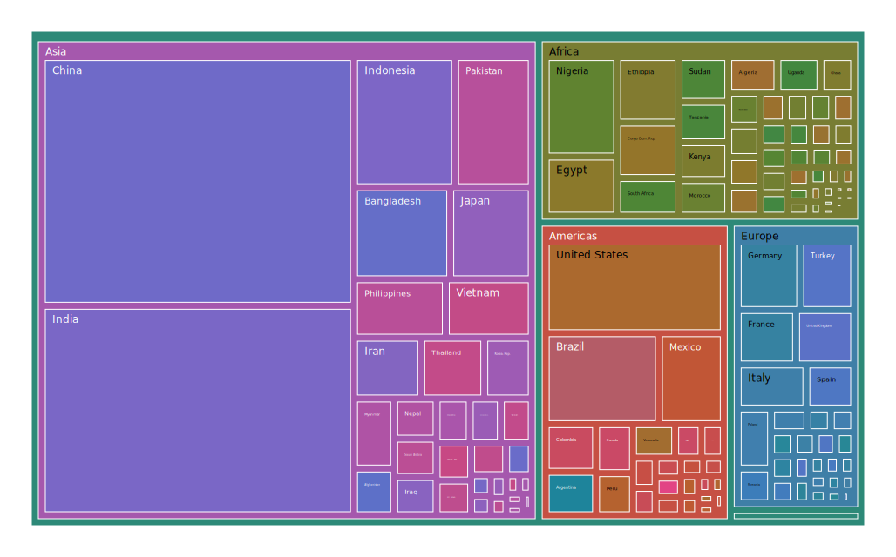
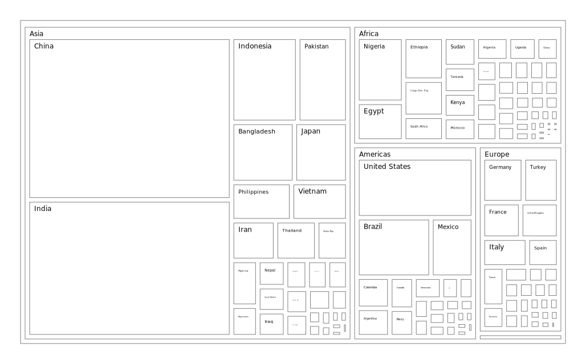
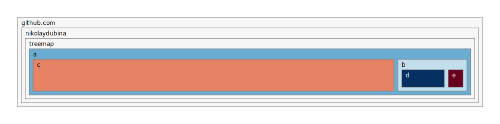
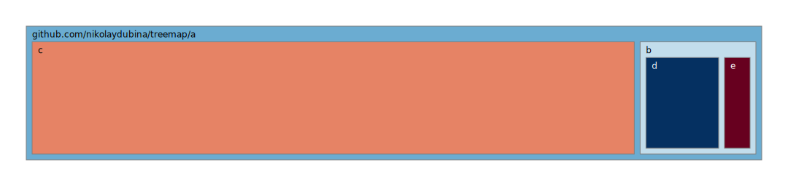
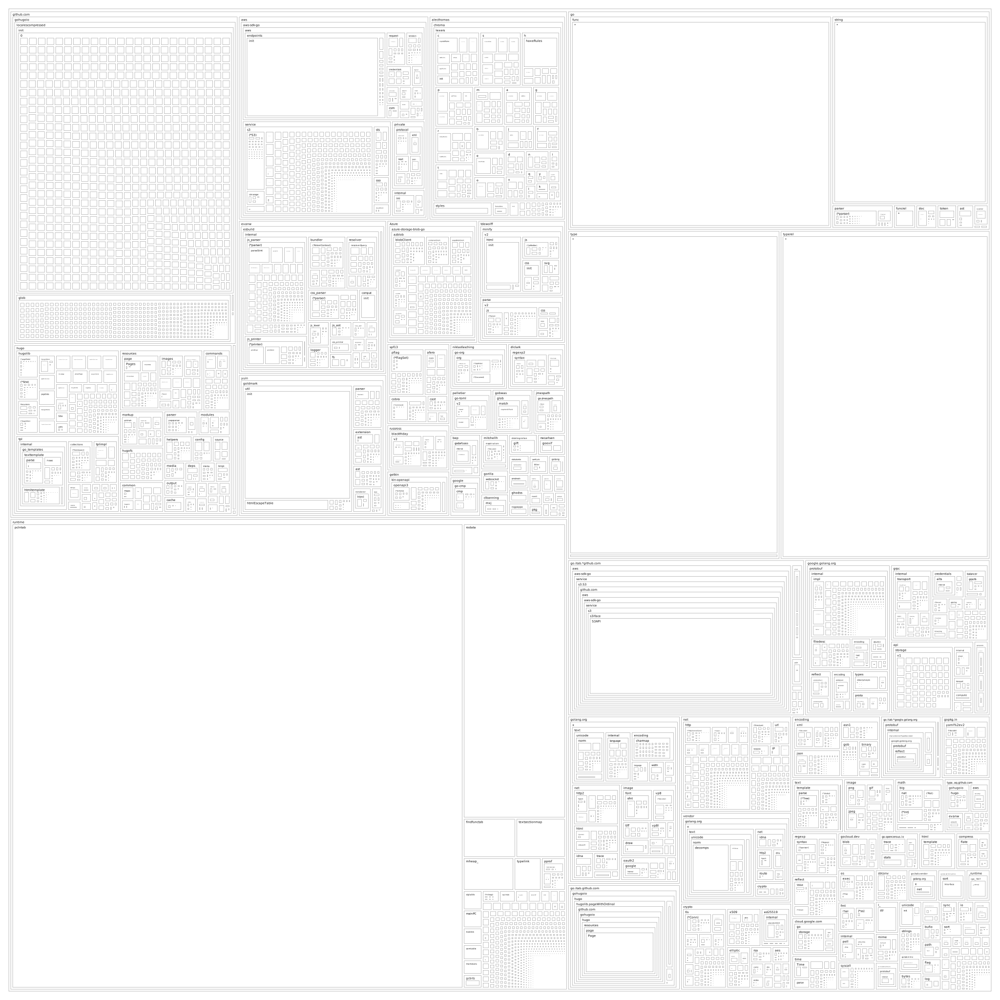

# Memory efficient Treemaps

Uses "Squarified Treemaps" (Mark Bruls, Kees Huizing, and Jarke J. van Wijk., 2000) algorithm.

The original code was copied from Nikolay Dubina's treemap repo (Check resources)

```bash
$ go install github.com/MazenAlKhatib/treemap/cmd/treemap@latest
$ treemap -input your_csv_file -output-path your/output/path -w 1024 -h 1024
```



Different colorscheme
```bash
$ treemap -color RdYlGn
```


Tree-Hue coloring
```
$ treemap -color balanced
```


Without color
```bash
$ treemap -color none
```


## Format

```
</ delimitered path>,<size>
```

## Algorithms

* `Squarified` algorithm for treemap layout problem. This is very common algorithm used in Plotly and most of visualization packages. _"Squarified Treemaps", Mark Bruls, Kees Huizing, and Jarke J. van Wijk, 2000_
* `Tree-Hue Color` algorithm for generating colors for nodes in treemap. The idea is to represent hierarchical structure by recursively painting similar hue to subtrees. _Nikolay Dubina, 2021_


## Contributions

Are much appreciated!

## References

* Nikolay Dubina: https://github.com/nikolaydubina/treemap **(Original Repo and code)**
* Plotly treemaps: https://plotly.com/python/treemaps/
* go-colorful: https://github.com/lucasb-eyer/go-colorful
* D3 treemap is using Squerified: https://github.com/d3/d3-hierarchy
* Interactive treemap: https://github.com/vasturiano/treemap-chart
* Squerified in Rust: https://github.com/bacongobbler/treemap-rs
* Squerified in JavaScript: https://github.com/clementbat/treemap
* Squerified in Python: https://github.com/laserson/squarify
* Treemap Go tool: https://github.com/willpoint/treemap
* Plotly color scales: https://plotly.com/python/builtin-colorscales
* Plotly color scales source: https://github.com/plotly/plotly.py/blob/master/packages/python/plotly/_plotly_utils/colors/colorbrewer.py
* Colorbrewer project, that is used in Plotly: http://colorbrewer2.org

## Appendix A: Long Roots

When roots have one child multiple times it takes extra vertical space, which is very useful for narrow final dimensions.



Can collapse them into one node


Long roots without collapsing somewhere deep inside



Long roots with collapsing somewhere deep inside


## Appendix B: Known Issues

### The entire treemap is a black box when viewed from Jenkins

It's convenient to create treemap svg reports in a Jenkins jobs, because you can
browse the job's "artifacts" from your browser.  However, out of the box, Jenkin's
[Content Security Policy](https://www.jenkins.io/doc/book/security/configuring-content-security-policy/)
prevents inline styles from being applied. Instead of your treemap, you'll see
a giant black rectangle.

If you look at the javascript console in the developer tools, you will see:
```
Refused to apply inline style because it violates the following
Content Security Policy directive: "style-src 'self'".
```

You can relax Jenkin's CSP rules by following the examples at:
* [Jenkins error - Blocked script execution in <URL>. because the document's frame is sandboxed and the 'allow-scripts' permission is not set](https://stackoverflow.com/questions/34315723/jenkins-error-blocked-script-execution-in-url-because-the-documents-frame)
* [https://stackoverflow.com/questions/35783964/jenkins-html-publisher-plugin-no-css-is-displayed-when-report-is-viewed-in-j](https://stackoverflow.com/questions/35783964/jenkins-html-publisher-plugin-no-css-is-displayed-when-report-is-viewed-in-j)

